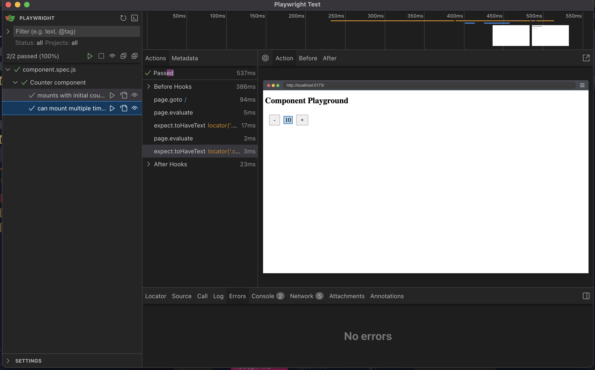

# Playwright Component Testing POC

This repository demonstrates a lightweight approach to component testing using Playwright, without requiring the full component testing infrastructure. The key innovation is using a global mounting function that allows components to be dynamically mounted via the browser's JavaScript context, but automated by Playwright.

## Concept

Traditional component testing often requires complex setup and infrastructure. This proof of concept shows how you can achieve similar results with a simpler approach using a normal website as an automatable playground:

1. A global `mountComponent` function is added to a page that Playwright will navigate to
2. Playwright tests use `page.evaluate()` to mount components that have already been built via a running development server

## Demo

Here's the component test in action, showing the Counter component being tested:



## Prerequisites

- Node.js (LTS version recommended)
- pnpm

## Installation

```bash
  pnpm install
```

## Project Structure

```
├── src/
│   ├── main.js        # Component definitions and mounting logic
│   └── style.css      # Component styles
├── tests/
│   └── component.spec.js  # Playwright test specifications
└── index.html         # Test container HTML
```

## Running Tests

Start the development server and run tests:

```bash
  # Run tests in headless mode
  pnpm test

  # Run tests with UI mode
  pnpm test:ui
```

## Development

Start the development server:

```bash
  pnpm dev
```

## How It Works

1. Components are defined using a factory pattern that creates DOM elements
2. A global `mountComponent` function is exposed on the `window` object:
   ```javascript
   window.mountComponent = (componentName, props = {}) => {
     // Mount component and return testing API
   };
   ```
3. Tests use `page.evaluate()` to mount components:
   ```javascript
   await page.evaluate(() => {
     window.mountComponent('Counter', { initialCount: 5 });
   });
   ```
4. Components return a testing API for interaction:
   ```javascript
   return {
     getText: () => testContainer.textContent,
     getCount: () => testContainer.querySelector('.count').textContent,
     // ... other methods
   };
   ```

## Configuration

The setup uses standard Playwright configuration with a web server integration:

```javascript
  webServer: {
    command: 'pnpm dev',
    url: 'http://localhost:5173',
    reuseExistingServer: !process.env.CI,
  }
```

This ensures the development server is running during tests.
